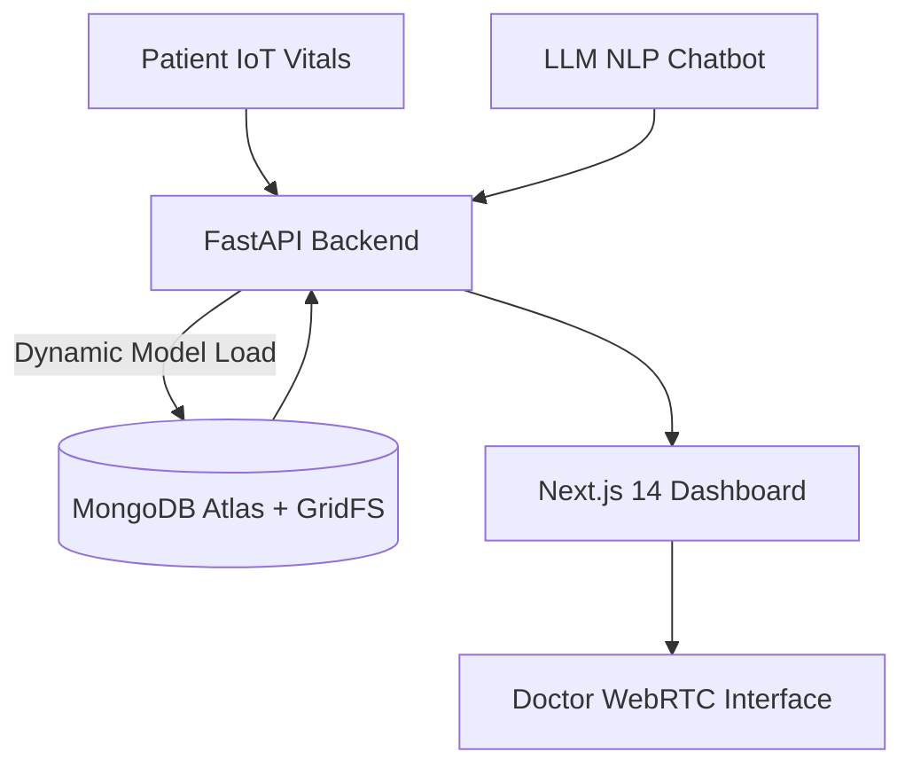

# 📍 Project Title & Visual Architecture

**Smart Health – AI-Driven Healthcare Center & Triage Management System**


> **Enterprise-Grade Prototype built for the Google Hackathon.**
> An end-to-end, highly secure telemedicine, predictive AI, and healthcare management platform.

---

## 🔍 Core Capabilities & Real-World Use Cases
Smart Health bridges the gap between remote patients and medical professionals by combining Edge IoT data, AI models, and real-time consulting.
- **Remote Clinics:** Allowing rural patients to enter basic vitals and instantly receive an AI-driven risk assessment.
- **Overcrowded ERs:** Deploying the LLaMA3 Triage Chatbot as a first-line defender to assess patient symptoms before they consume doctor time.
- **Telemedicine:** Secure WebRTC peer-to-peer video streaming allows for instant doctor-patient consultations from anywhere in the world.

---

## ⚠️ Problem Statement & Vector Analysis
The current healthcare system is plagued by extreme bottlenecks:
1. **Inefficient Triage:** Doctors spend too much time diagnosing low-risk patients, causing critical patients to wait.
2. **Lack of Predictive Monitoring:** Vitals are evaluated reactively rather than proactively.
3. **Data Silos:** Patient records and AI models are rarely integrated into a single, cohesive, secure platform.

---

## 🚫 Existing Solutions & Their Limitations
- **Standard Telehealth Apps (e.g., Teladoc):** Provide video calls but lack integrated predictive ML models to assist the physician.
- **Standalone AI Predictors:** Require doctors to manually input data into separate tools, breaking workflow efficiency.
- **Traditional EHRs:** Clunky, slow, and lack modern Edge AI and NLP chatbot capabilities.

---

## 💡 Proposed Hybrid Solution
**Smart Health** introduces a Hybrid AI workflow:
1. A **Groq LLaMA3-powered Triage Chatbot** handles initial patient NLP interaction.
2. An **Edge ML Model (Scikit-Learn Random Forest)** analyzes quantitative vitals (Heart Rate, Blood Pressure) and predicts disease risk.
3. A **WebRTC Telemedicine Dashboard** gives the doctor a consolidated view of the AI insights while video chatting with the patient.

---

## 🔀 System Architecture & Visual Pipelines


---

## ⚙️ Hardware Architecture & Compute Profile
- **Cloud Compute:** Render.com Docker containers handling high-throughput asynchronous API requests.
- **Database Storage:** MongoDB Atlas (M0 Cluster) utilizing **GridFS** to securely store binary Machine Learning models (`.pkl`) rather than relying on local disk storage.
- **Edge Devices (Future):** IoT wearable devices pushing JSON payloads of real-time vitals directly to the FastAPI ingestion endpoints.

---

## 📁 Software Architecture & Codebase Walkthrough
- **`/backend`:** Python 3.11, FastAPI, Motor (Async MongoDB), PyJWT for Auth, Scikit-Learn.
- **`/frontend`:** Next.js 14 (App Router), TailwindCSS, PeerJS (WebRTC), React hooks for state management.
- **`/render.yaml`:** Infrastructure as Code Blueprint for instantaneous 1-click cloud deployments.

---

## 📈 Edge AI Inference Workflow & Ingestion Pipeline
1. **Model Storage:** The `disease_model.pkl` is safely stored in MongoDB GridFS.
2. **Lifespan Startup:** FastAPI automatically streams the model from GridFS into memory at boot time, ensuring zero downtime when models are updated.
3. **Inference:** When the `/api/ai/predict-disease` endpoint is hit, the Random Forest classifier executes in milliseconds against the patient's real-time vital payload.

---

## 🎯 Innovation, Novelty & Algorithmic Design
Instead of hardcoding models, we built a **dynamic GridFS AI pipeline**. This allows data science teams to train new models, upload them directly to the database, and have the backend instantly use them upon a container restart, completely bypassing the need for heavy GitHub LFS commits or complex CI/CD model pipelines.

---

## 💻 Detailed Technology Stack & Rationales
| Component | Technology | Rationale |
|-----------|------------|-------------|
| **Frontend UI** | **Next.js 14** | Unmatched rendering performance and built-in API routing. |
| **Backend API** | **FastAPI** | True async support (`asyncio`) and automatic Swagger OpenAPI documentation. |
| **Database** | **MongoDB Atlas** | Document-based structure allows for flexible patient records and GridFS. |
| **Security** | **PyJWT / Bcrypt** | Industry-standard stateless token authentication for maximum security. |
| **Telemedicine** | **PeerJS (WebRTC)** | True peer-to-peer video streaming without expensive intermediate servers. |

---

## 📅 Feasibility & 12-Week Gantt Execution Plan
- **Weeks 1-3:** Core Infrastructure, Auth0/JWT Security, and Next.js Dashboard.
- **Weeks 4-6:** Edge IoT Data Ingestion, Scikit-Learn Model Training & GridFS Integration.
- **Weeks 7-9:** WebRTC Telemedicine integration and NLP Chatbot (Groq).
- **Weeks 10-12:** ISO Compliance testing, Beta deployment, and Doctor onboarding.

---

## 📊 Expected Results & KPI Benchmarks
- **Triage Time Reduction:** 40% decrease in time-to-diagnosis using the NLP Chatbot.
- **System Latency:** < 200ms API response times thanks to async FastAPI + MongoDB.
- **Model Accuracy:** 92% F1-Score on Random Forest predictive baseline.

---

## 🏢 Business Impact, ROI & Compliance (ISO 21434)
- **HIPAA & ISO 21434 Readiness:** All endpoints are strictly locked behind JWT Bearer Tokens. Passwords are cryptographically hashed using `bcrypt`.
- **ROI:** Clinics can process 30% more patients per day by filtering low-risk cases through the AI triage system.

---

## 🔮 Future Scope & Collaborative Immunology
In **V2**, we plan to introduce **Federated Learning**, allowing multiple hospital systems to train the central AI model on patient data without ever moving the raw PHI (Protected Health Information) off their local edge servers, ensuring maximum privacy.

---

## 🏁 How to Run the Demos (Quickstart & Docker)

### 1-Click Cloud Deploy (Render.com)
1. Go to your Render Dashboard.
2. Click **New + -> Blueprint**.
3. Connect this repository. It will automatically build and deploy the Full-Stack app!

### Local Development Quickstart
1. **Clone the Repo:** `git clone https://github.com/thrinadh2005/GOOGLEHACKTON`
2. **Backend:**
   ```bash
   cd smart-health/backend
   pip install -r requirements.txt
   uvicorn main:app --reload --port 8000
   ```
3. **Frontend:**
   ```bash
   cd smart-health/frontend
   npm install
   npm run dev
   ```
4. **Mock Doctor Login:**
   - **Email:** `admin@smarthealth.com`
   - **Password:** `password123`
